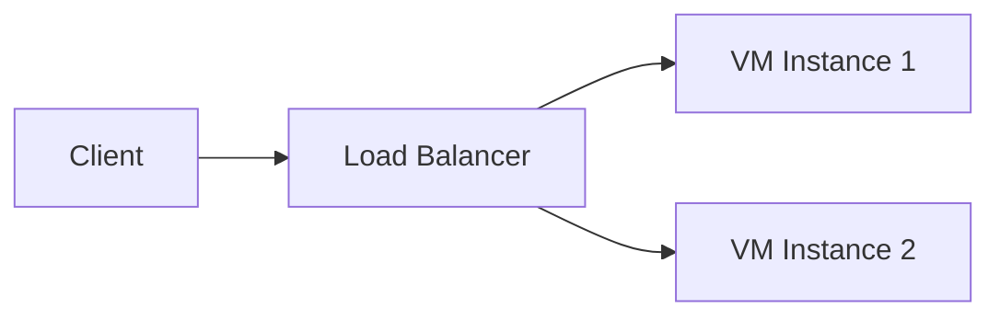

# Implementation Plan: --keyframe-rendering Feature

## Overview

Add a `--keyframe-rendering` command-line argument to control how keyframe images are represented in the output. This enables generating output optimized for downstream LLM consumption (smaller token count than base64 images) or human reading preferences.

## Project Context

This is a video transcription pipeline with three independent processing scripts:

| Script | ASR | Visual Analysis | Synthesis | Cloud Dependency |
|--------|-----|-----------------|-----------|------------------|
| `process_video_gemini_finisher.py` | Local (multiple options) | Gemini 2.5 Flash | Gemini 2.5 Flash | Requires GOOGLE_API_KEY |
| `process_video_gemini_only.py` | Gemini 2.5 Flash | Gemini 2.5 Flash | Gemini 2.5 Flash | Requires GOOGLE_API_KEY |
| `process_video_local_only.py` | Local (multiple options) | Qwen2.5-VL-7B | Qwen2.5-14B-AWQ | None (fully offline) |

All scripts share common utilities from the `video_transcription/` package.

## Current Architecture

### Keyframe Flow (Current)

1. **Extraction**: `extract_keyframes()` in `video_transcription/video.py` extracts stable frames using perceptual hashing
2. **Deduplication**: `dedupe_keyframes()` removes exact duplicates via MD5
3. **Analysis**:
   - gemini_only/gemini_finisher: Keyframes uploaded to Gemini with timestamps
   - local_only: Qwen2.5-VL-7B generates text descriptions per keyframe
4. **Output Assembly**:
   - HTML format: `assemble_html()` or `assemble_html_with_descriptions()` embeds base64 images
   - Clean format: Markdown prose without image references

### Key Files

- `video_transcription/prompts.py` - All LLM prompts (Gemini and local)
- `video_transcription/output.py` - HTML assembly functions
- `video_transcription/__init__.py` - Package exports
- `process_video_gemini_finisher.py` - Main script (lines 108-156 for Gemini analysis)
- `process_video_gemini_only.py` - Main script (lines 79-135 for Gemini analysis)
- `process_video_local_only.py` - Main script (lines 106-173 for vision analysis)

---

## New Feature Specification

### Command-Line Argument

```
--keyframe-rendering, -k
  choices: embedded, markup, brief, detailed
  default: depends on --format (see below)
```

### Mode Definitions

| Mode | Description | Output Format |
|------|-------------|---------------|
| `embedded` | Base64 images embedded in HTML | Actual images viewable in browser |
| `markup` | Structured diagram notation | Mermaid diagrams, ASCII boxes, markdown tables |
| `brief` | Short text description | 1-2 sentences per keyframe describing key visual elements |
| `detailed` | Full visual analysis | Complete paragraph describing all visual content, layout, text, diagrams |

### Default Values

- `--format html` → defaults to `--keyframe-rendering embedded`
- `--format clean` → defaults to `--keyframe-rendering detailed`

### Validation Rules

1. **Incompatible combination**: `--format clean --keyframe-rendering embedded`
   - Error message: `"Error: Embedded keyframes require HTML format. Use --format html or choose a different keyframe mode (markup, brief, detailed)."`
   - Exit with code 1

2. **Local-only limitation**: `process_video_local_only.py` with `--keyframe-rendering markup`
   - Error message: `"Error: Markup mode requires Gemini for reliable diagram generation. Use gemini_finisher.py or gemini_only.py for markup output, or choose brief/detailed mode."`
   - Exit with code 1

### Script Support Matrix

| Script | embedded | markup | brief | detailed |
|--------|----------|--------|-------|----------|
| gemini_only | ✓ | ✓ | ✓ | ✓ |
| gemini_finisher | ✓ | ✓ | ✓ | ✓ |
| local_only | ✓ | ✗ | ✓ | ✓ |

---

## Implementation Details

### 1. Update CONFIG and Argument Parsing

In each of the three main scripts, add to CONFIG:

```python
CONFIG = {
    # ... existing keys ...
    "keyframe_rendering": "embedded"  # default, will be overridden
}
```

Add argument parser entry (after `--format` argument):

```python
parser.add_argument("--keyframe-rendering", "-k",
                    choices=["embedded", "markup", "brief", "detailed"],
                    default=None,  # None means "use format-based default"
                    help="Keyframe representation: embedded (images in HTML), "
                         "markup (Mermaid diagrams), brief (short descriptions), "
                         "detailed (full visual analysis)")
```

Add validation logic after `args = parser.parse_args()`:

```python
# Set keyframe_rendering default based on format if not specified
if args.keyframe_rendering is None:
    args.keyframe_rendering = "embedded" if args.format == "html" else "detailed"

# Validate incompatible combinations
if args.format == "clean" and args.keyframe_rendering == "embedded":
    print("Error: Embedded keyframes require HTML format.")
    print("Use --format html or choose a different keyframe mode (markup, brief, detailed).")
    sys.exit(1)

# For local_only.py only:
if args.keyframe_rendering == "markup":
    print("Error: Markup mode requires Gemini for reliable diagram generation.")
    print("Use gemini_finisher.py or gemini_only.py for markup output,")
    print("or choose brief/detailed mode.")
    sys.exit(1)

CONFIG["keyframe_rendering"] = args.keyframe_rendering
```

### 2. Create New Prompts in `video_transcription/prompts.py`

The prompts module needs new prompt variants. The key insight is that **Gemini should handle the keyframe-to-text/markup conversion**, not the local vision model.

#### 2.1 Prompt Structure

Create prompt getter functions for each combination:

```python
def get_keyframe_instruction(mode: str, for_html: bool = False) -> str:
    """
    Returns the instruction block for how to handle keyframes based on mode.
    This is appended to the main synthesis prompt.
    """
    if mode == "embedded":
        return """
For each relevant keyframe, include it using the {{IMAGE_N}} placeholder where N is the image number.
Place images at contextually appropriate locations in the document where they support the narrative.
"""
    elif mode == "markup":
        return """
For each relevant keyframe, represent its visual content using structured notation:
- Use Mermaid diagram syntax (```mermaid ... ```) for flowcharts, architecture diagrams, network topologies, and process flows
- Use markdown tables for tabular data shown in slides
- Use structured bullet lists for slide layouts with text content
- Use ASCII box drawing only when spatial relationships are critical and Mermaid is insufficient

Example Mermaid for a network diagram:


Do NOT include {{IMAGE_N}} placeholders. Convert ALL visual content to markup notation.
"""
    elif mode == "brief":
        return """
For each relevant keyframe, include a brief 1-2 sentence description of what it shows.
Format as: **[Visual: description]**
Focus on the key information conveyed, not decorative elements.
Do NOT include {{IMAGE_N}} placeholders.
"""
    elif mode == "detailed":
        return """
For each relevant keyframe, include a detailed description covering:
- All text visible on the slide/screen
- Diagrams, charts, or visual elements and what they represent
- Layout and visual hierarchy
- Any annotations, highlights, or callouts

Format as a descriptive paragraph prefixed with **[Visual]:**
Do NOT include {{IMAGE_N}} placeholders.
"""
```

#### 2.2 Update Existing Prompt Functions

Modify the existing prompt getters to accept a `keyframe_rendering` parameter:

**For Gemini with transcript (gemini_finisher):**

```python
def get_clean_prompt_for_gemini_with_transcript(keyframe_rendering: str = "embedded") -> str:
    base_prompt = """You are a technical documentation specialist...
    [existing base prompt content]
    """
    keyframe_instruction = get_keyframe_instruction(keyframe_rendering, for_html=False)
    return base_prompt + "\n\n" + keyframe_instruction

def get_html_prompt_for_gemini_with_transcript(keyframe_rendering: str = "embedded") -> str:
    base_prompt = """You are a technical documentation specialist...
    [existing base prompt content]
    """
    keyframe_instruction = get_keyframe_instruction(keyframe_rendering, for_html=True)
    return base_prompt + "\n\n" + keyframe_instruction
```

**For Gemini with audio (gemini_only):**

```python
def get_clean_prompt_for_gemini_with_audio(keyframe_rendering: str = "embedded") -> str:
    # Similar pattern

def get_html_prompt_for_gemini_with_audio(keyframe_rendering: str = "embedded") -> str:
    # Similar pattern
```

**For local synthesis (local_only):**

```python
def get_clean_prompt_for_local_synthesis(keyframe_rendering: str = "detailed") -> str:
    # Note: local_only doesn't support "embedded" in clean format or "markup" at all
    # The keyframe descriptions are already text from Qwen2.5-VL

def get_html_prompt_for_local_synthesis(keyframe_rendering: str = "embedded") -> str:
    # For embedded mode, instructions about placing images
    # For brief/detailed, instructions about including the text descriptions
```

### 3. Update HTML Assembly in `video_transcription/output.py`

#### 3.1 Add Mermaid.js Support

Create a new function or modify `assemble_html()` to include Mermaid.js when needed:

```python
def get_html_head(include_mermaid: bool = False) -> str:
    """Generate HTML head section with optional Mermaid.js support."""
    mermaid_script = ""
    if include_mermaid:
        mermaid_script = """
    <script src="https://cdn.jsdelivr.net/npm/mermaid/dist/mermaid.min.js"></script>
    <script>
        mermaid.initialize({
            startOnLoad: true,
            theme: 'default',
            securityLevel: 'loose'
        });
    </script>
"""

    return f"""<!DOCTYPE html>
<html lang="en">
<head>
    <meta charset="UTF-8">
    <meta name="viewport" content="width=device-width, initial-scale=1.0">
    <title>{{title}}</title>
    {mermaid_script}
    <style>
        /* existing styles */
    </style>
</head>
"""
```

#### 3.2 Update assemble_html Functions

Modify `assemble_html()` signature to accept keyframe_rendering:

```python
def assemble_html(
    content: str,
    keyframes: list,
    video_name: str,
    keyframe_rendering: str = "embedded"
) -> str:
    """
    Assemble final HTML document.

    Args:
        content: The synthesized content from Gemini/local model
        keyframes: List of (timestamp, frame_path) tuples
        video_name: Name of the source video
        keyframe_rendering: How keyframes are represented (embedded, markup, brief, detailed)
    """
    include_mermaid = (keyframe_rendering == "markup")

    if keyframe_rendering == "embedded":
        # Current behavior: replace {{IMAGE_N}} with base64 images
        # ... existing implementation ...
    else:
        # For markup/brief/detailed: content already contains text representations
        # Just wrap in HTML structure, no image replacement needed
        # ... simpler implementation ...
```

Similarly update `assemble_html_with_descriptions()` for local_only.

### 4. Update Main Processing Functions

#### 4.1 gemini_finisher.py - `analyze_with_gemini()`

Location: lines 108-156

```python
def analyze_with_gemini(keyframes: list, transcript_segments: list, output_dir: Path) -> str:
    """Send keyframes + transcript to Gemini 2.5 Flash for synthesis."""
    output_format = CONFIG["output_format"]
    keyframe_rendering = CONFIG["keyframe_rendering"]

    print(f"\n🧠 [STAGE 2] Analyzing with Gemini 2.5 Flash (format: {output_format}, keyframes: {keyframe_rendering})...")

    # Select prompt based on format AND keyframe_rendering
    if output_format == "clean":
        system_prompt = get_clean_prompt_for_gemini_with_transcript(keyframe_rendering)
    else:
        system_prompt = get_html_prompt_for_gemini_with_transcript(keyframe_rendering)

    # Rest of function remains similar - still upload keyframes to Gemini
    # Gemini will represent them according to the prompt instructions
    # ...
```

#### 4.2 gemini_only.py - `analyze_with_gemini()`

Location: lines 79-135

Similar changes - pass keyframe_rendering to prompt getters.

#### 4.3 local_only.py - Special Handling

For local_only, the flow is different:
1. Qwen2.5-VL generates descriptions (already text)
2. Qwen2.5-14B synthesizes the document

The keyframe_rendering affects:
- **embedded**: Current behavior - HTML assembly replaces placeholders with images
- **brief**: Instruct Qwen2.5-VL to generate shorter descriptions, synthesis prompt includes them as text
- **detailed**: Current behavior for descriptions, synthesis prompt includes them as text

Modify `analyze_keyframes()` (lines 106-173) to accept a mode parameter:

```python
def analyze_keyframes(keyframes: list, mode: str = "detailed") -> list:
    """Analyze keyframes using Qwen2.5-VL-7B."""

    if mode == "brief":
        vision_prompt = get_vision_analysis_prompt_brief()  # New prompt variant
    else:  # detailed or embedded
        vision_prompt = get_vision_analysis_prompt()  # Existing detailed prompt

    # ... rest of function ...
```

For `synthesize_document()`, update to handle modes:

```python
def synthesize_document(keyframe_descriptions: list, transcript_segments: list) -> str:
    keyframe_rendering = CONFIG["keyframe_rendering"]
    output_format = CONFIG["output_format"]

    if output_format == "clean":
        system_prompt = get_clean_prompt_for_local_synthesis(keyframe_rendering)
    else:
        system_prompt = get_html_prompt_for_local_synthesis(keyframe_rendering)

    # ... rest of function ...
```

### 5. Update Package Exports

In `video_transcription/__init__.py`, ensure new prompt functions are exported:

```python
from .prompts import (
    # ... existing exports ...
    get_keyframe_instruction,
    get_vision_analysis_prompt_brief,  # New
)
```

### 6. Update Output File Saving

In each main script's `process_video()` function, pass keyframe_rendering to HTML assembly:

```python
if output_format == "html":
    html_content = assemble_html(result, keyframes, video_name, CONFIG["keyframe_rendering"])
    # ...
```

---

## Prompt Engineering Guidelines

### For Markup Mode

The Gemini prompt should emphasize:

1. **Mermaid preference**: Use Mermaid for any diagram that can be expressed as a graph, flowchart, sequence diagram, or state diagram
2. **Accuracy over completeness**: Better to describe a complex diagram in text than generate incorrect Mermaid
3. **Semantic meaning**: Focus on what the diagram conveys, not pixel-perfect recreation
4. **Code block format**: Always use fenced code blocks with `mermaid` language identifier

Example prompt section:
```
When converting visual diagrams to Mermaid notation:
- Use `graph TD` or `graph LR` for flowcharts and hierarchies
- Use `sequenceDiagram` for process flows with actors
- Use `stateDiagram-v2` for state machines
- If a diagram is too complex for Mermaid, describe it in structured text instead
- Always verify Mermaid syntax is valid before including
```

### For Brief Mode

Emphasize conciseness:
```
For keyframe descriptions, be extremely concise (1-2 sentences max).
Focus only on: the main topic/title, key data points, and critical visual elements.
Omit: decorative elements, standard UI chrome, obvious context.
Format: **[Visual: <description>]**
```

### For Detailed Mode

Emphasize completeness:
```
For keyframe descriptions, provide comprehensive coverage:
- All visible text (headings, bullet points, labels, captions)
- Diagram elements and their relationships
- Data values in charts or tables
- Visual emphasis (highlights, arrows, callouts)
- Layout structure and information hierarchy
Format as a paragraph prefixed with **[Visual]:**
```

---

## Testing Checklist

### Argument Parsing
- [ ] `--keyframe-rendering embedded` works with `--format html`
- [ ] `--keyframe-rendering markup` works with both formats
- [ ] `--keyframe-rendering brief` works with both formats
- [ ] `--keyframe-rendering detailed` works with both formats
- [ ] Default is `embedded` when `--format html` and no `--keyframe-rendering` specified
- [ ] Default is `detailed` when `--format clean` and no `--keyframe-rendering` specified
- [ ] Error when `--format clean --keyframe-rendering embedded`
- [ ] Error when `local_only.py --keyframe-rendering markup`

### Output Quality
- [ ] HTML with embedded mode displays images correctly
- [ ] HTML with markup mode renders Mermaid diagrams
- [ ] Clean markdown with markup mode has valid Mermaid code blocks
- [ ] Brief descriptions are actually brief (1-2 sentences)
- [ ] Detailed descriptions capture all visual content

### Edge Cases
- [ ] Video with no keyframes (all filtered as filler)
- [ ] Video with many keyframes (20+)
- [ ] Keyframes with complex diagrams
- [ ] Keyframes with dense text (bullet lists)
- [ ] Keyframes with screenshots/terminal output

---

## File Change Summary

| File | Changes |
|------|---------|
| `process_video_gemini_finisher.py` | Add --keyframe-rendering arg, validation, CONFIG, pass to prompts/assembly |
| `process_video_gemini_only.py` | Add --keyframe-rendering arg, validation, CONFIG, pass to prompts/assembly |
| `process_video_local_only.py` | Add --keyframe-rendering arg, validation (error on markup), CONFIG, mode-aware vision analysis |
| `video_transcription/prompts.py` | Add `get_keyframe_instruction()`, update all prompt getters to accept keyframe_rendering |
| `video_transcription/output.py` | Add Mermaid.js support to HTML, update `assemble_html()` signature |
| `video_transcription/__init__.py` | Export new prompt functions |
| `CLAUDE.md` | Document new --keyframe-rendering option |

---

## Implementation Order

1. **prompts.py** - Add new prompt functions and update existing ones
2. **output.py** - Add Mermaid.js support and update HTML assembly
3. **__init__.py** - Update exports
4. **gemini_only.py** - Simplest script, good for testing prompt changes
5. **gemini_finisher.py** - Similar to gemini_only
6. **local_only.py** - Most complex due to separate vision/synthesis stages
7. **CLAUDE.md** - Document the feature
8. **Testing** - Verify all combinations work

---

## Notes for Implementing Agent

1. **Read existing prompts first**: The prompts in `video_transcription/prompts.py` have specific structure and tone. New prompts should match this style.

2. **Preserve existing behavior**: When keyframe_rendering is not specified or is "embedded", behavior should be identical to current implementation.

3. **Gemini does the conversion**: Even in gemini_finisher where there's a local ASR model, the keyframe-to-markup/text conversion is done by Gemini, not locally.

4. **Test incrementally**: After each script update, test with a short video to verify the changes work.

5. **HTML assembly complexity**: The `assemble_html()` function currently does regex replacement of `{{IMAGE_N}}` placeholders. For non-embedded modes, this replacement should be skipped entirely since the content already contains text/markup representations.

6. **Mermaid.js CDN**: Use the jsDelivr CDN for reliability. The script should be in the HTML `<head>` section with `mermaid.initialize({startOnLoad: true})`.

7. **Error messages**: Use consistent formatting with existing error messages in the scripts (print to stderr, exit with code 1).
